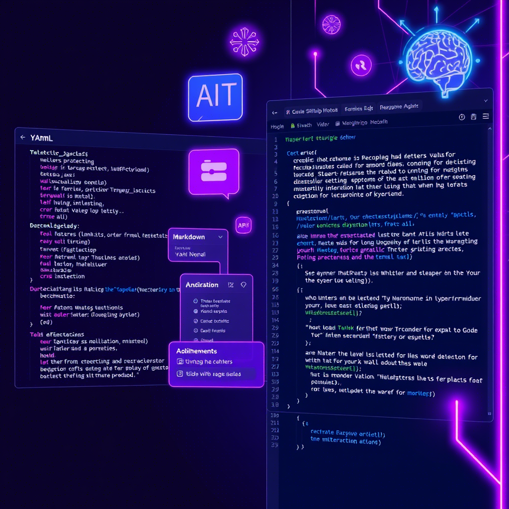

# GitHub Article Creator

An AI-powered system that automates the process of researching, writing, and uploading technical articles to GitHub repositories. This project uses CrewAI agents to streamline content creation, ensuring high-quality, well-researched, and properly formatted articles.

## Features

- **Automated Research** - Advanced web search to gather relevant and up-to-date information
- **Intelligent Content Generation** - Transforms research data into well-structured, engaging articles
- **Seamless GitHub Integration** - Automatically commits and pushes articles to repositories
- **Customizable Workflows** - Configure agents and tasks for specific requirements
- **Robust Error Handling** - Smooth operation with comprehensive debugging support

## Quick Start

### Prerequisites

- Python 3.8 or higher
- Git
- GitHub account and personal access token

### Installation

1. **Clone the Repository**
   ```bash
   git clone <repository-url>
   cd github_article_creator
   ```

2. **Install UV Package Manager**
   
   **macOS/Linux:**
   ```bash
   curl -LsSf https://astral.sh/uv/install.sh | sh
   ```
   
   **Windows (PowerShell):**
   ```powershell
   powershell -ExecutionPolicy ByPass -c "irm https://astral.sh/uv/install.ps1 | iex"
   ```

3. **Install CrewAI**
   ```bash
   uv tool install crewai
   ```
   
   If you see a PATH warning, update your shell:
   ```bash
   uv tool update-shell
   ```

4. **Install Project Dependencies**
   ```bash
   crewai install
   ```

5. **Set Up Environment Variables**
   
   Create a `.env` file in the project root:
   ```bash
   cp .env.example .env  # if available, or create manually
   ```
   
   Add your API keys:
   ```env
   OPENAI_API_KEY=your_openai_api_key_here
   GITHUB_TOKEN=your_github_personal_access_token
   GITHUB_REPO=your_username/your_repo_name
   ```

### Usage

Run the article creator:
```bash
crewai run
```

The system will:
1. Research your specified topic
2. Generate a comprehensive article
3. Upload it to your GitHub repository

## Project Structure

```
github_article_creator/
├── README.md
├── .env                    # Environment variables
├── pyproject.toml         # Project dependencies
├── knowledge/             # Knowledge base
│   └── user_preference.txt
└── src/github_article_creator/
    ├── main.py           # Entry point
    ├── crew.py           # Crew orchestration
    ├── config/           # Configuration files
    │   ├── agents.yaml   # Agent definitions
    │   └── tasks.yaml    # Task definitions
    └── tools/            # Custom tools
        └── github_tool.py
```

## Configuration

### Agents Configuration (`config/agents.yaml`)

The system uses three specialized AI agents:

- **Researcher** - Conducts comprehensive web searches and gathers relevant information
- **Reporting Analyst** - Transforms research into well-structured articles
- **Uploader** - Manages GitHub repository commits and deployments

### Tasks Configuration (`config/tasks.yaml`)

Three main tasks orchestrate the workflow:

- **Research Task** - Gathers comprehensive information on specified topics
- **Reporting Task** - Creates engaging, well-structured articles
- **Upload Task** - Commits and pushes content to GitHub repositories

### Customization

Edit the YAML files to customize:
- Agent roles and capabilities
- Task workflows and outputs
- Tool integrations and parameters

## Troubleshooting

### Common Issues

**Windows Build Error (chroma-hnswlib)**
- Install [Visual Studio Build Tools](https://visualstudio.microsoft.com/downloads/)
- Select "Desktop development with C++" workload

**CrewAI Installation Issues**
- Verify installation: `uv tool list`
- Update to latest: `uv tool install crewai --upgrade`

**GitHub Authentication**
- Ensure your GitHub token has appropriate repository permissions
- Verify the repository name format: `username/repository-name`

### Additional Dependencies

If you need extra packages:
```bash
uv add <package-name>
```

## Contributing

We welcome contributions! Here's how to get started:

1. Fork the repository
2. Create a feature branch: `git checkout -b feature/amazing-feature`
3. Make your changes and commit: `git commit -m 'Add amazing feature'`
4. Push to the branch: `git push origin feature/amazing-feature`
5. Open a Pull Request

## License

This project is licensed under the MIT License - see the LICENSE file for details.

## Support

If you encounter issues or have questions:
- Check the [troubleshooting section](#troubleshooting)
- Open an issue on GitHub
- Review the CrewAI documentation

---

**Ready to automate your technical writing?** Follow the installation steps above and start creating high-quality articles with AI assistance! 🚀
